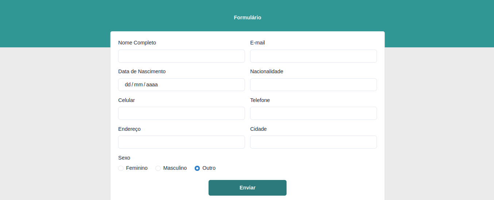

# Formulario  usando Reactjs

### Descrição
Este projeto tem como finalizade estudar React.Js utilizando a Biblioteca [Chakra UI](https://chakra-ui.com/)

## ✔️ Tecnologias utilizadas

- ``HTML``
- ``CSS``
- ``JavaScript``
- ``ReactJS``
